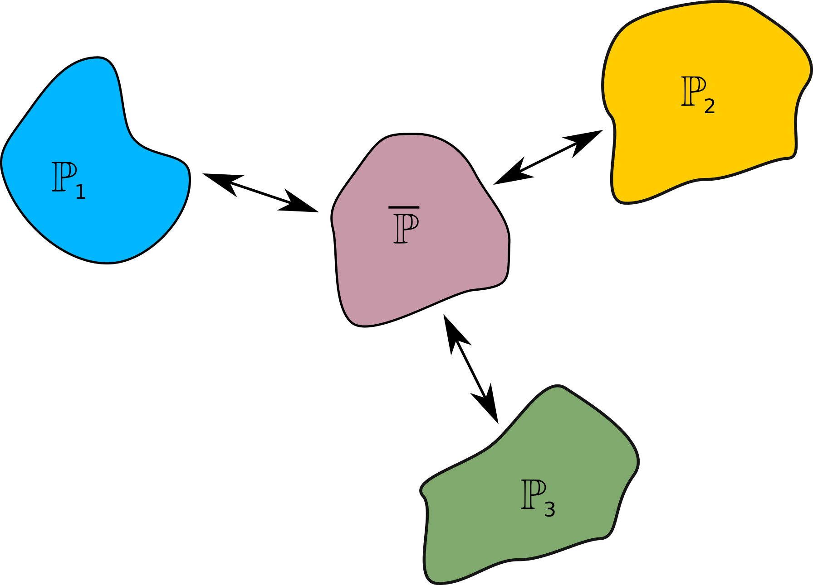
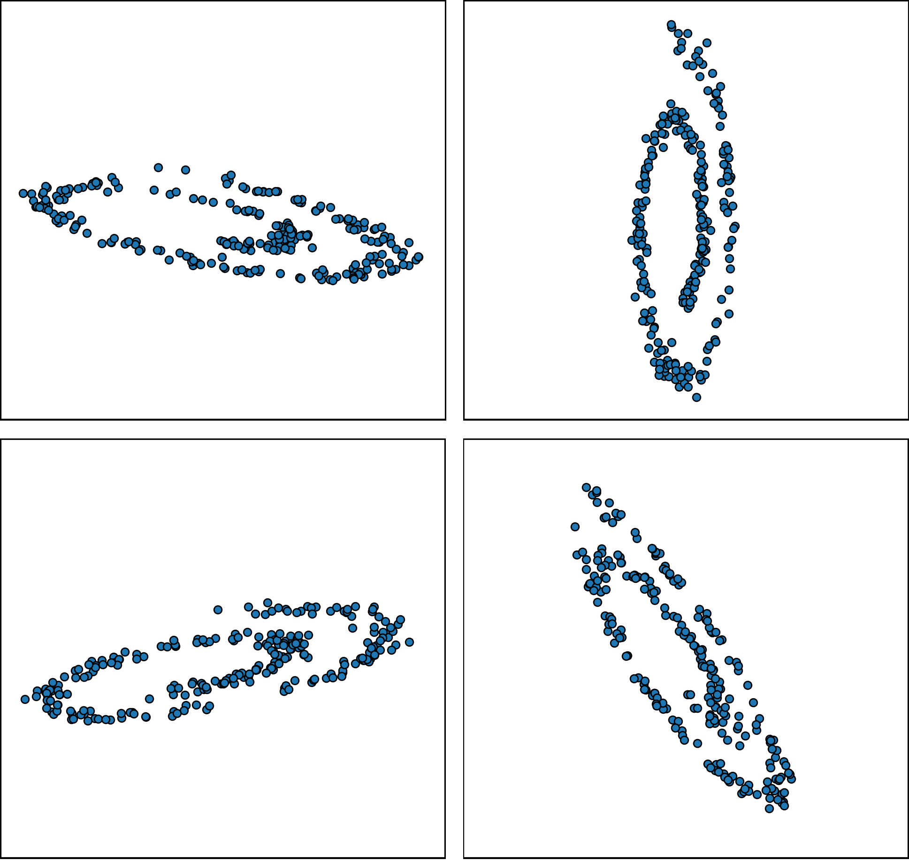
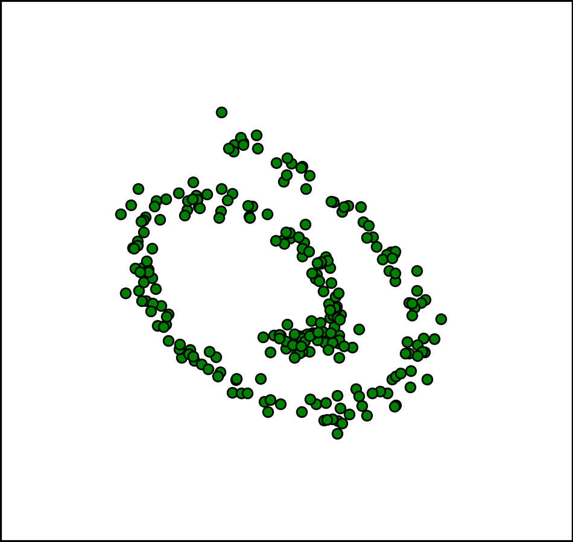
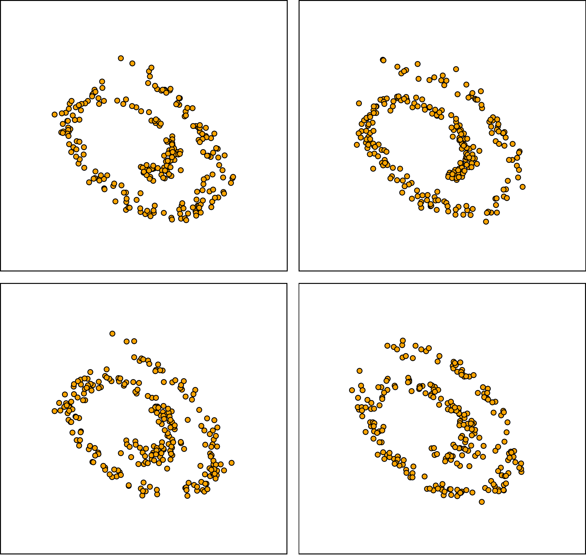
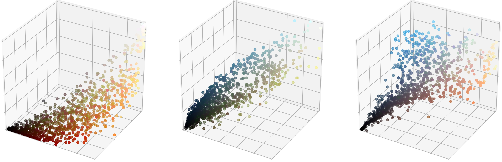
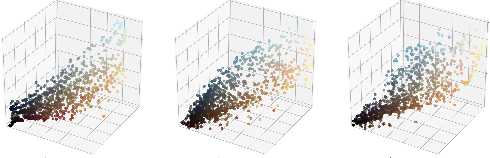

# Continuous Wasserstein-2 Barycenter Estimation without Minimax Optimization
This is the official `Python` implementation of the [ICLR 2021](https://iclr.cc/Conferences/2021) paper **Continuous Wasserstein-2 Barycenter Estimation without Minimax Optimization** (paper on [openreview](https://openreview.net/forum?id=3tFAs5E-Pe)) by [Alexander Korotin](https://scholar.google.ru/citations?user=1rIIvjAAAAAJ&hl=en), [Lingxiao Li](https://scholar.google.com/citations?user=rxQDLWcAAAAJ&hl=en), [Justin Solomon](https://scholar.google.com/citations?user=pImSVwoAAAAJ&hl=en) and [Evgeny Burnaev](https://scholar.google.ru/citations?user=pCRdcOwAAAAJ&hl=ru)

The repository contains the fully-reproducible `PyTorch` source code for computing **Wasserstein-2 barycenters** in high dimensions via the **non-minimax** method (proposed in the paper) by using **input convex neural networks**. Examples are provided for various toy examples and the example of averaging image color palettes.

<p align="center"></p>

## Citation
```
@inproceedings{
  korotin2021continuous,
  title={Continuous Wasserstein-2 Barycenter Estimation without Minimax Optimization},
  author={Alexander Korotin and Lingxiao Li and Justin Solomon and Evgeny Burnaev},
  booktitle={International Conference on Learning Representations},
  year={2021},
  url={https://openreview.net/forum?id=3tFAs5E-Pe}
}
```

## Prerequisites
The implementation is GPU-based. Single GPU (~GTX 1080 ti) is enough to run each particular experiment. Main prerequisites are:
- [pytorch](http://pytorch.org/)
- [torchvision](https://github.com/pytorch/vision)
- CUDA + CuDNN

## Related repositories
- [Repository](https://github.com/iamalexkorotin/Wasserstein2GenerativeNetworks) for [Wasserstein-2 Generative Networks](https://openreview.net/pdf?id=bEoxzW_EXsa) paper.
- [Repository](https://github.com/lingxiaoli94/CWB) for [Continuous Regularized Wasserstein Barycenters](https://proceedings.neurips.cc/paper/2020/file/cdf1035c34ec380218a8cc9a43d438f9-Paper.pdf) paper.

## Repository structure
The code for running the experiments are located in self-contained jupyter notebooks (`notebooks/`). For convenience, the majority of the evaluation output is preserved. Other auxilary source code is moved to `.py` modules (`src/`).

### Experiments
- `notebooks/CW2B_toy_experiments.ipynb.ipynb` -- **toy experiments** (in dimensions up to 256) and subset posterior aggregation.
- `notebooks/CW2B_averaging_color_palettes.ipynb` -- averaging **color palettes** of images.
### Input convex neural networks
- `src/icnn.py` -- modules for Input Convex Neural Network architectures (**DenseICNN**);
<p align="center"></p>

### Poster
- `poster/CW2B_poster.png` -- poster (landscape format)
- `poster/CW2B_poster.svg` -- source file for the poster
<p align="center"></p>

## Visualized Results
The provided code is capable of generating the following visual results that are included in the paper.
### Toy Experiments (2D)
Example below contains 4 initial distributions (on the left), the ground truth barycenter (in the middle) and the barycenter computed by each of 4 potentials recovered by our algithm (on the right).
<p align="center"></p>

### Color Palette Averaging (3D)
Example below demonstrates barycenters of RGB (3D) color palettes of three images.

**Original images and color palettes**
<p align="center">
<p align="center">
  
**"Averaged" images and color palettes** (estimated by each of three potentials computed by our algorithm)
<p align="center">
<p align="center">
